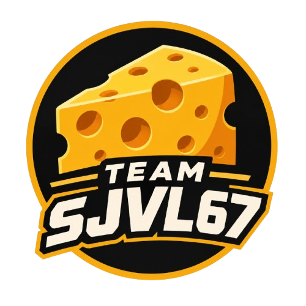

# WRO 2026 Future Engineers – SJVL67

  
  

  
  
  

  

  
  
  

---

---

##  **Table of Contents**
- [ 1. Complete Documentation Structure](#complete-documentation-structure)
- [ 2. The Team](#the-team)
- [ 3. Challenge Overview](#challenge-overview)
- [ 4. Our Robot](#our-robot)
- [ 5. Electronic Systems](#electronic-systems)
- [ 6. Mechanical Systems](#mechanical-systems)
- [ 7. Software Architecture](#software-architecture)
- [ 8. Performance Videos](#performance-videos)
- [ 9. GitHub Utilization & Development](#github-utilization--development)
- [ 10. License & Replication](#license--replication)

---

## 1. **Complete Documentation Structure** 

## **DETAILED TECHNICAL DOCUMENTATION AVAILABLE**

### **Each folder contains comprehensive README documentation with specialized technical content**

| 📁 Folder | 🎯 Technical Content | 📖 Detailed Documentation |
|-----------|----------------------|---------------------------|
| **⚙ Models** | **Mechanical Engineering** • 3D CAD designs • Assembly instructions • Gear system calculations | [🔗 Models Documentation](models/README.md) |
| **🔌 Schemes** | **Electrical Systems** • Wiring diagrams • Power management • Component schematics & datasheets | [🔗 Schematics Documentation](schemes/README.md) |
| **💾 Source Code** | **Software Algorithms** • Navigation logic • Sensor fusion • Control systems | [🔗 Software Documentation](src/README.md) |
| **👥 Team Photos** | **Team Documentation** • Member profiles • Development journey • Competition preparation | [🔗 Team Photos Documentation](t-photos/README.md) |
| **🚗 Vehicle Photos** | **Vehicle Documentation** • Multi-angle views • Component labeling • System integration | [🔗 Vehicle Photos Documentation](v-photos/README.md) |
| **🎥 Videos** | **Performance Validation** • Challenge demonstrations • Engineering tests • System validation | [🔗 Performance Videos Documentation](video/README.md) |
| **📚 Other Resources** | **Technical References** • Component images • Development resources • Additional documentation | [🔗 Additional Resources Documentation](other/README.md) |

---

## 2. **The Team** 

Team SJVL67 includes passionate students from Ecuador, guided by a coach. This is our **first year** competing in the WRO Future Engineers category, and each member brings unique skills to the project, from mechanical design to computer vision.

### **Members**
- **Eduardo Rivadeneira**  
  *Role*: Electronics, Mechanical Design, Strategy Integration  
  *Background*: Second Bach Student, Physics Area, Robotics club since 2022, American School of Guayaquil  
  *Born*: 2009, Ecuador

- **Henry Riera**  
  *Role*: Computer Vision Research, Software, Strategy  
  *Background*: Second Bach Student, Physics Area, Robotics club since 2023, American School of Guayaquil  
  *Born*: 2010, Ecuador

- **Geovanny Li**  
  *Role*: Computer Vision Research, Software, Strategy  
  *Background*: First Bach Student, Robotics club since 2023, American School of Guayaquil  
  *Born*: 2011, Ecuador

### **Coach**
- **Henry Cercado**  
  *Role*: Team Coach, Connector  
  *Background*: Teacher, Computer Science, Computer Science Engineer, American School of Guayaquil   
  *Born*: 1994, Ecuador

### **Team Journey Moments**

---

## 3. **Challenge Overview** 

The **WRO 2026 Future Engineers** challenge pushes teams to develop a **fully autonomous vehicle** capable of navigating a **dynamic and randomized racetrack** using **sensors, computer vision, and advanced control algorithms**. The goal is to complete **multiple laps** while adapting to randomized obstacles, following **strict driving rules**, and successfully executing a **parallel parking maneuver** at the end of the course.

###  Competition Format 

- ** Open Challenge**: The vehicle must complete **three (3) laps** on a track with **randomly placed inside walls**.

- ** Obstacle Challenge**: The vehicle must complete **three (3) laps** while detecting and responding to **randomly placed red and green traffic signs**:
  - 🟥 **Red markers** ➜ The vehicle must stay on the **right side of the lane**.
  - 🟩 **Green markers** ➜ The vehicle must stay on the **left side of the lane**.
  
  After completing the three laps, the vehicle must **locate the designated parking zone** and perform a **precise parallel parking maneuver** within a limited space, adding an extra layer of difficulty.
  
- ** Documentation**: Each team must maintain a **public GitHub repository** showcasing their **engineering process, vehicle design, and source code**.

### Scoring & Evaluation
Scoring is based on **accuracy, technical documentation and speed**, rewarding teams that balance **efficiency, adaptability, and innovation**. This challenge not only tests **robotics and programming skills** but also promotes **problem-solving, teamwork, and engineering creativity**.

 **Find out more about the challenge [here](https://wro-association.org/wp-content/uploads/WRO-2026-Future-Engineers-Self-Driving-Cars-General-Rules.pdf).**
