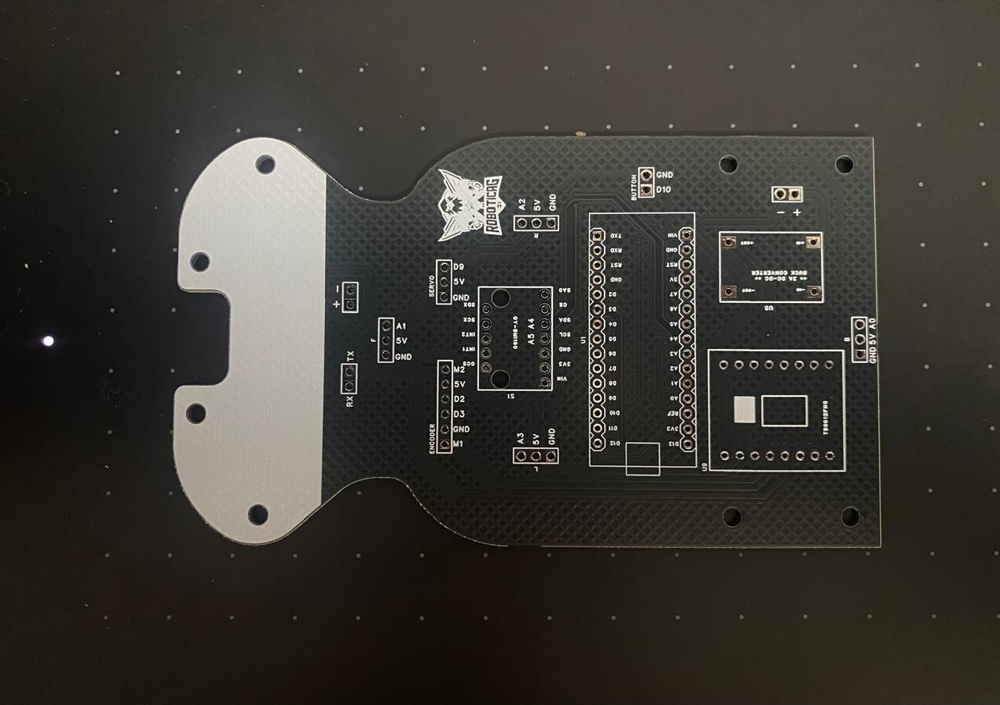
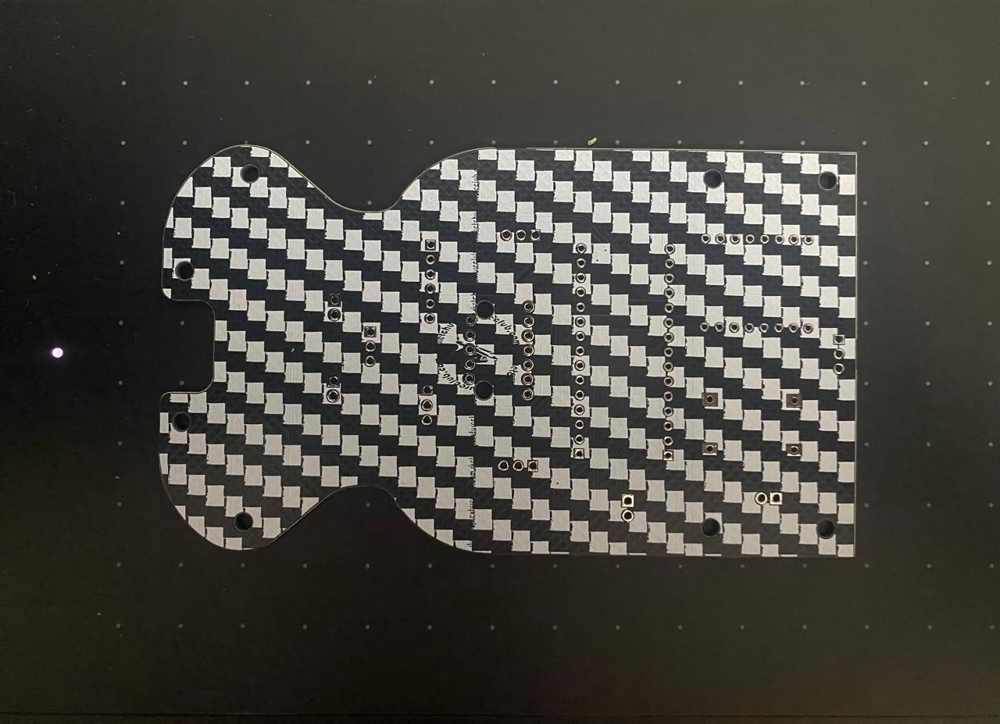
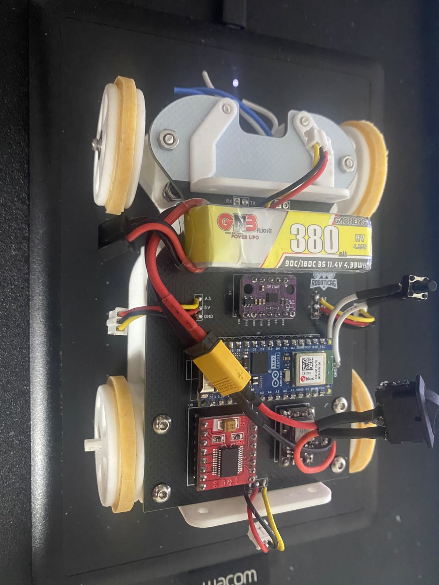
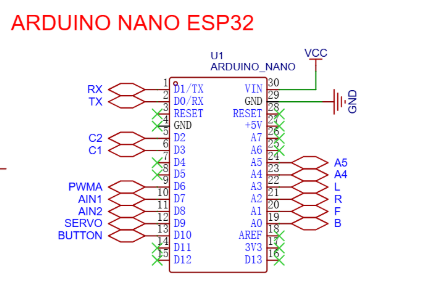
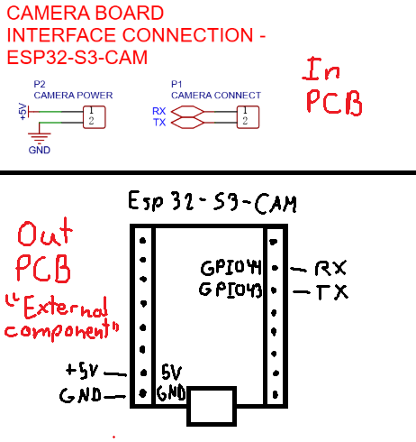
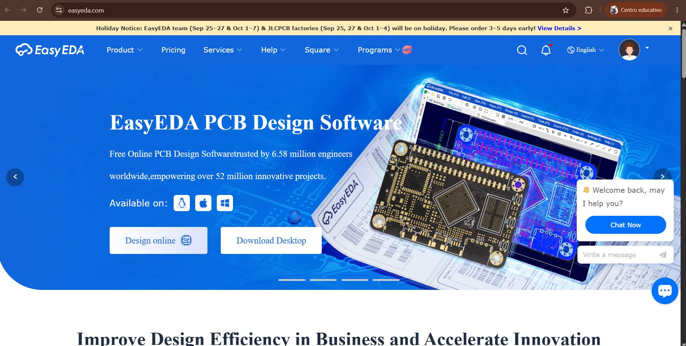
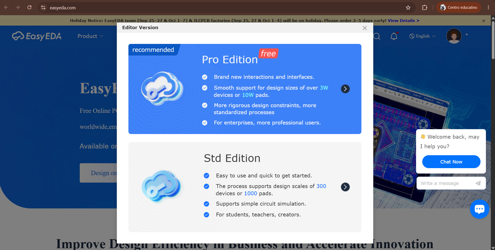
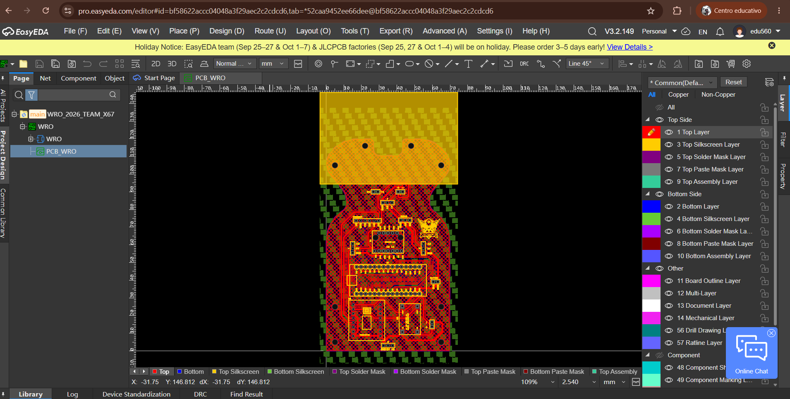
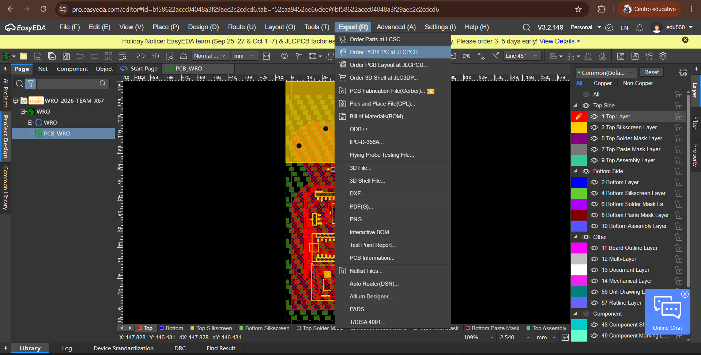
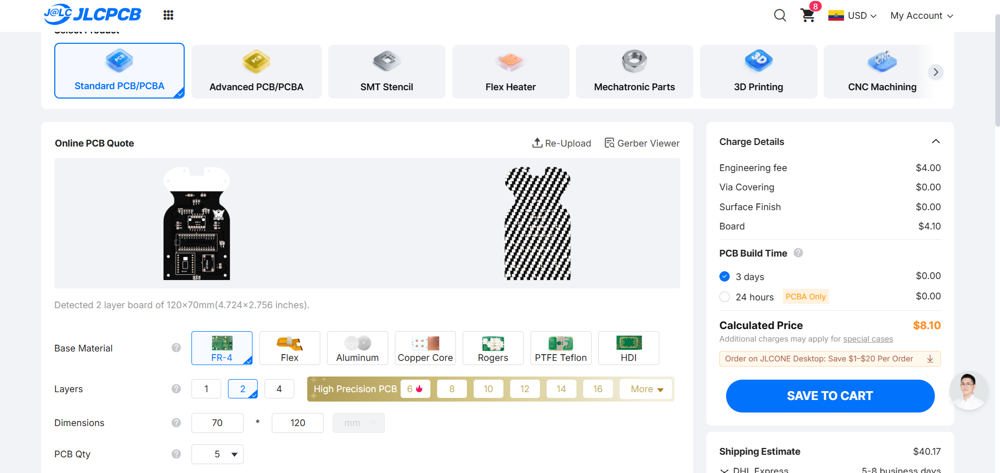

# Schemes Documentation

This folder contains the complete electrical schematics, and power management documentation for Team SJVL67 WRO 2026 Future Engineers robot. All the electronics were assambled in a custom PCB designed by us to achieve optimal performance and organization in our robot.

## Complete Bill of Materials (BOM)

| Component | Image | Quantity | Type | Description |
|-----------|-------|----------|------|-------------|
| ARDUINO NANO ESP32 |  | 1 | Sensor Microcontroller | Dual-core 240MHz microcontroller with 512KB SRAM and 3.3V logic. Used for sensor managing, controlling the motors, and processing data. |
| ESP32-S3-CAM |  | 1 | Camera Microcontroller | Dual-core 240MHz processor with vector instructions and 3.3V logic. Used for computer vision. |
| OV2640 |  | 1 | 2MP camera | A 2-Megapixel CMOS sensor with a 68° view angle and 3.6mm focal length. |
| TOF400C |  | 4 | ToF sensor | 400cm range, 27° FOV - used for front, back, and sides detection. |
| BMI160 |  | 1 | 6-axis IMU |  A 6-axis motion sensor combining a 3-axis accelerometer and a 3-axis gyroscope for navigation. |
| TB6612FNG DRIVER |  | 1 | Motor Driver |  A PWM motor driver for DC motor control |
| VOLTAGE REGULATOR |  | 1 | Voltage Regulator |  A step-down 5v voltage regulator to power the microcontrollers and the sensors. |
| SG90 SERVO |  | 1 | Servo Motor | Micro servo motor for the steering mechanism. |
| 1000rpm N20 motor |  | 1 | DC Motor + Encoder | Brushed DC motor with Hall effect encoder. |
| GNB 3s 380mAh lipo |  | 1 | Battery | 11.4V 380mAh lipo battery. |
| Start Button |  | 1 | Start Button | Start action initiation button. |
| Custom Tire |  | 1 | Tire | 41mm diameter, 5mm silicon tire. |

---

## Complete Wiring System

  ### - PCB Schematic

  
  
  

  
  
  
  

  
  <em>1) Digitally traced the wiring diagram showing all the external connections of the pcb. • 2) Front side of the manufactured pcb. • 3) Back side of the
  manufactured pcb.</em>

  
### - Wiring to PCB

  
  
  
  

                

  
<em>1) Digitally traced the wiring diagram showing all the external connections of the pcb. • 2) hysical implementation of the Wiring diagram.</em>

---

## Component-Specific Engineering

### - Microcontrollers

  
  
  
  

  
<em>1) Arduino Nano ESP32 sensor interface and peripherals microcontroller • 2) ESP32-S3-CAM camera microcontroller..</em>

---

## PCB Manufacturing process

### - Why we choosed to use a PCB?

We choosed a pcb due to the organization management that it provides to the electronics. We wanted to use a custom pertinax board but it was too bulky, but in the end we selected the PCB for the the previous mentioned reasons, even if it presented the problem of slow manufacturing and modification produced by the need of get them machined in China, we are from Ecuador. With us making a custom design we developed the essential engineering skills to manufacture it int the best way.

The complete PCB and all related to its design was made using the EDA, electronic design autoamtion, program EasyEDA. We use this program due to the simplicity of its use compared to other progrmas such as Proteus or KiCad learning curve, also because it provides a huge amount of components, footprints, to use at the schematics, this made the proces of making the PCB easier as it already provided the parts that we used. 

The principal reason to use EasyEDA is because of its connection with their manufacturing company JLCPCB, the company where we had the PCBs made. This EDA platform of which we used the web browser pro version, made the process of designing the PCB much easier and the steps we followed to manufacture our design are shown in the next part:

  
  

Fist of all we entered the platform, website, of EasyEDA, where we desinged our board based on the schematic created in the same platform following our required needs.

  
  

We selected the pro version of it as for this project we decided to use it due to the additional features it includes over the standard versiom.

  
  

We entered the projct that we previusly made, the PCB derived from the schemati

  
  

We entered the projct that we previusly made, the PCB derived from the schematic, so we could then export it diectly from the EDA platform to JlcPCB and manufacture it.

  
  

We then selected our order specification of the PCB, the ones considered for this project where the thicknes of the board, we used 1.6mm, and the color, although is free to your choice.

---

## Interface and control systems

---

## Datasheet references

| Component | Datasheet File | Key Specifications |
|-----------|----------------|-------------------|
| **TB6612FNG Motor Driver** | [TB6612FNG.PDF](TB6612FNG.PDF) | PWM motor control |
| **SG90 Servo** | [SG90.PDF](SG90.PDF) | micro size servo, torque specifications |
| **OV2640 Camera** | [OV2640DS.pdf](OV2640DS.pdf) | 2MP resolution, interface timing |
| **BMI160 IMU** | [BMI160.pdf](BMI160.pdf) | 6-axis motion tracking |
| **N20 Motor** | [N20_motors.pdf](N20_motors.pdf) | Motor and encoder specifications |
| **Arduino Nano ESP32** | [Arduino_nano_esp32-datasheet.pdf](Arduino_nano_esp32-datasheet.pdf) | Pin interfaces that handle sensors and peripherals |
| **ESP32-S3-CAM** | [GitHub: esp32s3-cam](https://github.com/nulllaborg/esp32s3-cam/tree/main) | Dual-core architecture, peripherals |
| **DC Buck Converter** | [CN3903.PDF](CN3903.PDF) | DC-DC step-down converter, 5v |
| **TOF400C ToF Sensor** | [DS_vl53l1x.pdf](DS_vl53l1x.pdf) | 400cm range, 27° FOV operation |
