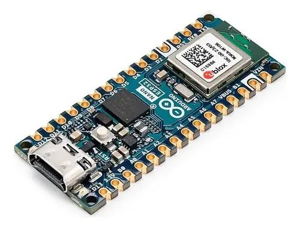
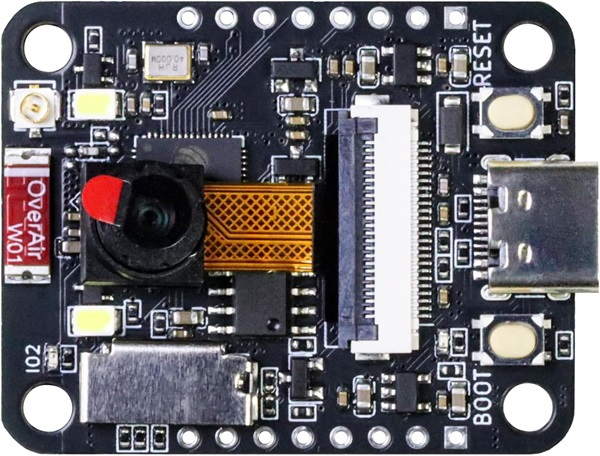

# Schemes Documentation

This folder contains the complete electrical schematics, and power management documentation for Team SJVL67 WRO 2026 Future Engineers robot. All the electronics were assambled in a custom PCB designed by us to achieve optimal performance and organization in our robot.

## Why we choosed a PCB?

We choosed a pcb due to the organization management that it provides to the electronics. We used a web based EDA in order to design this PCB, the program used was EasyEDA. We wanted to use a custom pertinax board but it was too bulky, but in the end we selected the PCB for the the previous mentioned reasons, even if it presented the problem of slow manufacturing and modification produced by the need of get them machined in China, we are from Ecuador. With us making a custom design we developed the essential engineering skills to manufacture it int the best way.

## 📋 Complete Bill of Materials (BOM)

| Component | Image | Quantity | Type | Description |
|-----------|-------|----------|------|-------------|
| Arduino Nano ESP32 |  | 1 | Sensor Microcontroller | Dual-core 240MHz microcontroller with 512KB SRAM and 3.3V logic. Used for sensor managing, controlling the motors, and processing data. |
| ESP32-S3-CAM |  | 1 | Camera Microcontroller | Dual-core 240MHz processor with vector instructions and 3.3V logic. Used for computer vision. |
| OV2640 |  | 1 | 2MP camera | A 2-Megapixel CMOS sensor with a 68° view angle and 3.6mm focal length. |
| TOF400C |  | 4 | ToF sensor | 400cm range, 27° FOV - used for front, back, and sides detection |

---

  

This directory must contain one or several schematic diagrams in form of JPEG, PNG or PDF of the electromechanical components illustrating all the elements (electronic components and motors) used in the vehicle and how they connect to each other.
