# Schemes Documentation

This folder contains the complete electrical schematics, and power management documentation for Team SJVL67 WRO 2026 Future Engineers robot. All the electronics were assambled in a custom PCB designed by us to achieve optimal performance and organization in our robot.

## - Why we choosed a PCB?

We choosed a pcb due to the organization management that it provides to the electronics. We used a web based EDA in order to design this PCB, the program used was EasyEDA. We wanted to use a custom pertinax board but it was too bulky, but in the end we selected the PCB for the the previous mentioned reasons, even if it presented the problem of slow manufacturing and modification produced by the need of get them machined in China, we are from Ecuador. With us making a custom design we developed the essential engineering skills to manufacture it int the best way.

## Complete Bill of Materials (BOM)

| Component | Image | Quantity | Type | Description |
|-----------|-------|----------|------|-------------|
| ARDUINO NANO ESP32 |  | 1 | Sensor Microcontroller | Dual-core 240MHz microcontroller with 512KB SRAM and 3.3V logic. Used for sensor managing, controlling the motors, and processing data. |
| ESP32-S3-CAM |  | 1 | Camera Microcontroller | Dual-core 240MHz processor with vector instructions and 3.3V logic. Used for computer vision. |
| OV2640 | 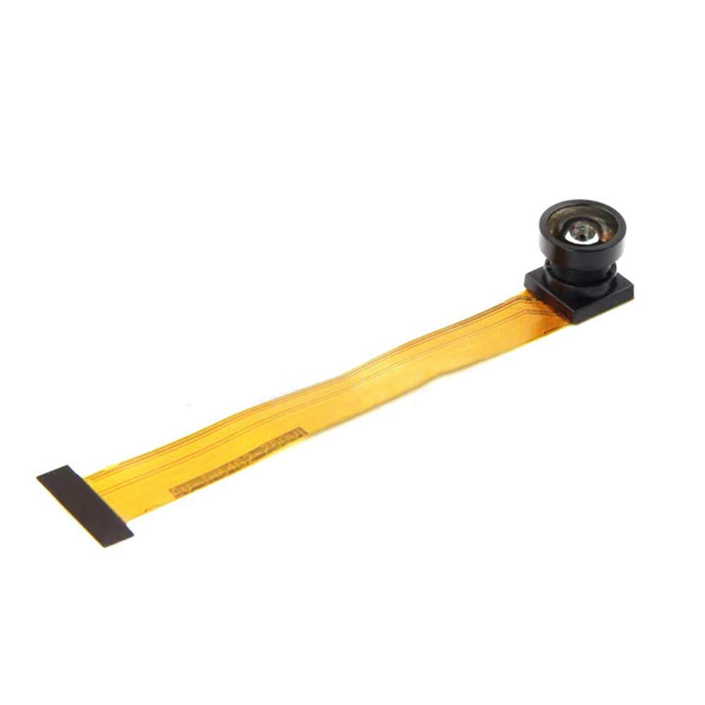 | 1 | 2MP camera | A 2-Megapixel CMOS sensor with a 68° view angle and 3.6mm focal length. |
| TOF400C | 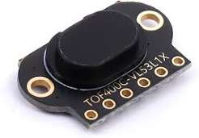 | 4 | ToF sensor | 400cm range, 27° FOV - used for front, back, and sides detection. |
| BMI160 | 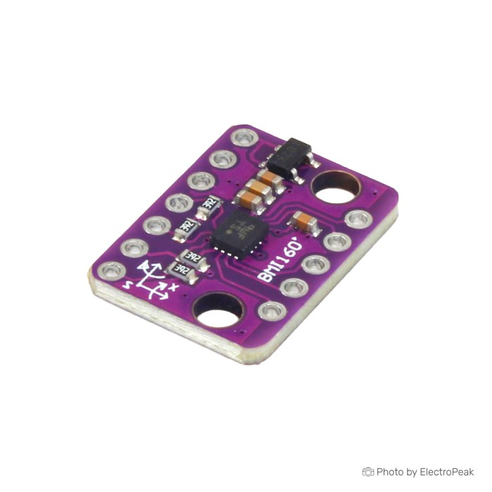 | 1 | 6-axis IMU |  A 6-axis motion sensor combining a 3-axis accelerometer and a 3-axis gyroscope for navigation. |
| TB6612FNG DRIVER | 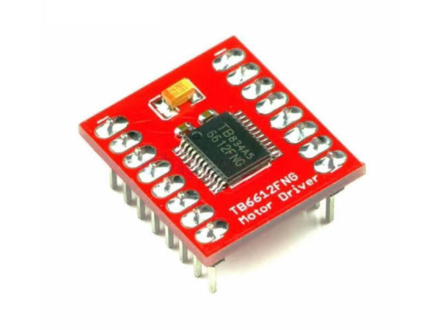 | 1 | Motor Driver |  A PWM motor driver for DC motor control |
| VOLTAGE REGULATOR | 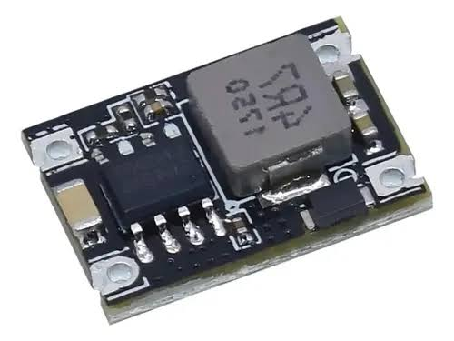 | 1 | Voltage Regulator |  A step-down 5v voltage regulator to power the microcontrollers and the sensors. |
| SG90 SERVO | 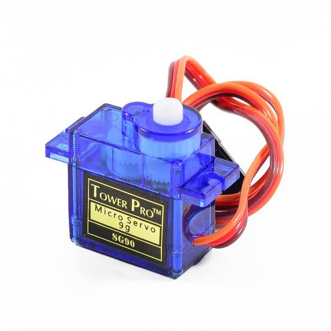 | 1 | Servo Motor | Micro servo motor for the steering mechanism. |
| 1000rpm N20 motor | 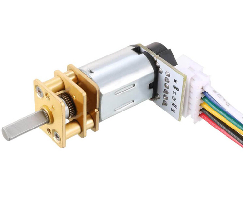 | 1 | DC Motor + Encoder | Brushed DC motor with Hall effect encoder. |
| GNB 3s 380mAh lipo | 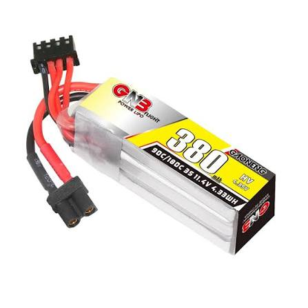 | 1 | Battery | 11.4V 380mAh lipo battery. |
| Start Button | 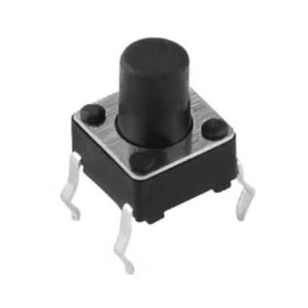 | 1 | Start Button | Start action initiation button. |
| Custom Tire | 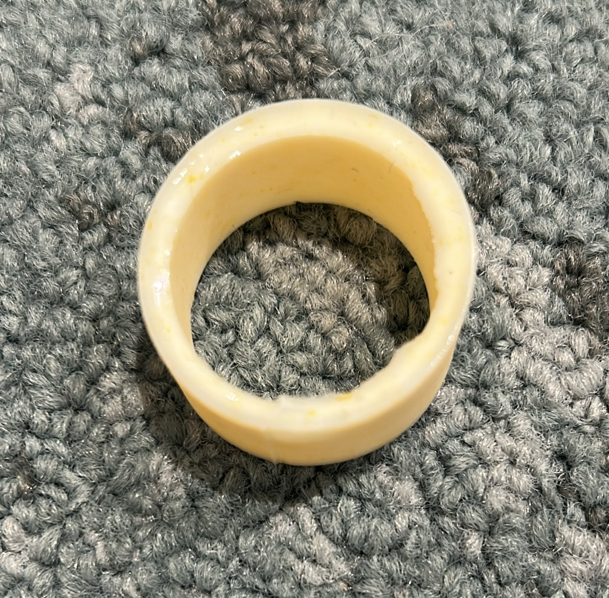 | 1 | Tire | 41mm diameter, 5mm silicon tire. |

---

## Complete Wiring System

  
  ### PCB Schematic
  
  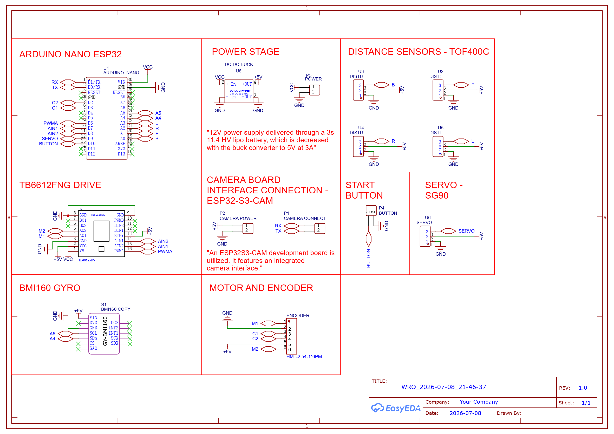
  

  
### Wiring to PCB

  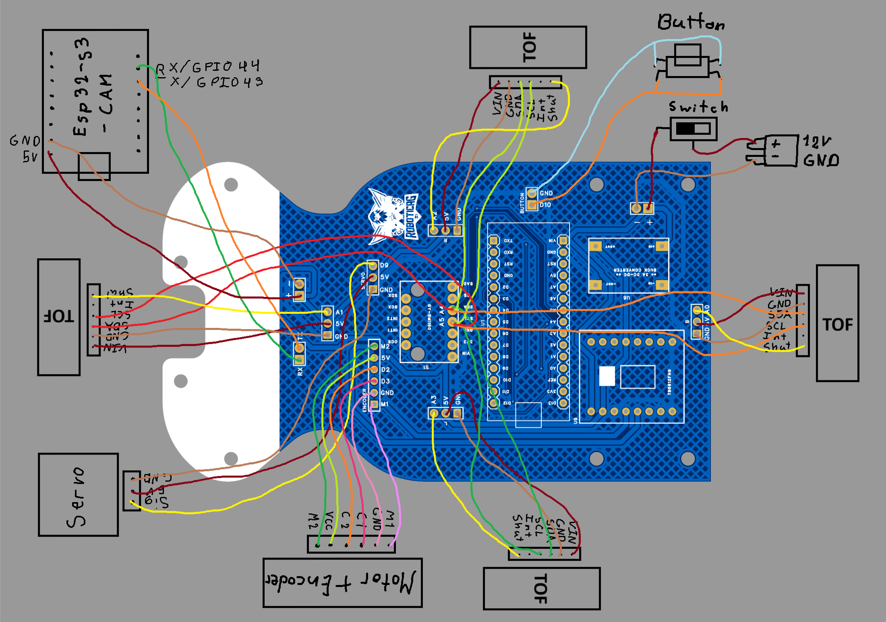
  

